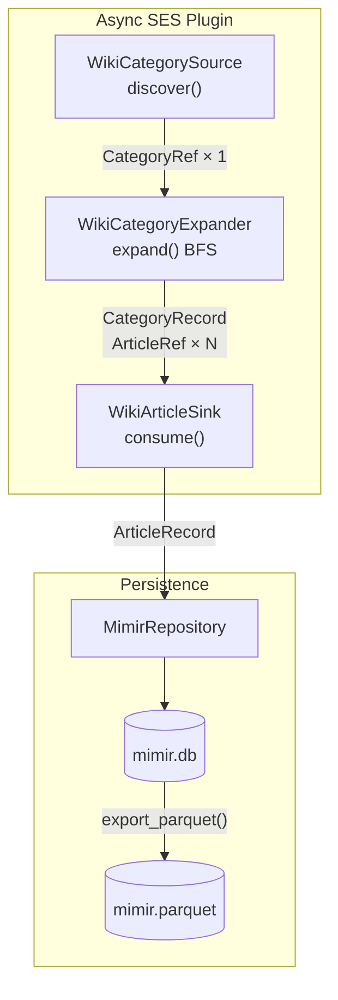

# ladon-mimir

[](https://github.com/MoonyFringers/ladon-mimir/actions/workflows/test.yml)
[](LICENSE)
[](https://www.python.org/downloads/)

Async Wikipedia adapter for the [Ladon](https://github.com/MoonyFringers/ladon) crawler framework.

Crawls a Wikipedia category tree via async BFS, fetches full article text
through the MediaWiki API, and persists everything to a DuckDB database —
ready to export as Parquet for LLM fine-tuning pipelines or downstream analysis.

Built as a first-party reference adapter for `Category:Mathematical_finance`,
but works with any Wikipedia category.

## Quick start

```bash
pip install ladon-mimir
ladon-mimir --category "Mathematical finance" --out mimir.db
```

No authentication. No external server. Wikipedia's API is public.

Re-running against the same `--out` file resumes automatically — already-stored
article page IDs are skipped.

## What you get

Each run writes two tables to `mimir.db`:

**`mimir_articles`** — one row per article (upserted on `page_id`):

| column | type | description |
|---|---|---|
| `run_id` | TEXT | UUID of the crawl run that last wrote this row |
| `page_id` | INTEGER | Wikipedia page ID (primary key) |
| `title` | TEXT | Article title |
| `summary` | TEXT | First paragraph of the article |
| `full_text` | TEXT | Full article text (extract) |
| `categories` | TEXT | JSON array of category names |
| `last_modified` | TIMESTAMPTZ | Last edit timestamp (UTC) |
| `word_count` | INTEGER | Word count of full text |
| `url` | TEXT | Canonical Wikipedia URL |

**`ladon_runs`** — one row per crawl run:

| column | type | description |
|---|---|---|
| `run_id` | TEXT | UUID for this crawl run |
| `category` | TEXT | Root category name |
| `started_at` | TIMESTAMPTZ | When the run started (UTC) |
| `finished_at` | TIMESTAMPTZ | When the run finished; NULL while running |
| `status` | TEXT | `running`, `done`, or `failed` |
| `articles_fetched` | INTEGER | Articles successfully saved |
| `articles_failed` | INTEGER | Articles that failed to fetch or parse |

### Sample DuckDB query

```sql
-- Longest articles in the corpus
SELECT title, word_count, url
FROM mimir_articles
ORDER BY word_count DESC
LIMIT 10;
```

## Export to Parquet

```bash
ladon-mimir --category "Mathematical finance" --out mimir.db --sync
```

Or from Python:

```python
from ladon_mimir import export_parquet

count = export_parquet("mimir.db", "mimir.parquet")
print(f"Exported {count} articles")
```

> **Note:** The `categories` column is exported as a JSON-encoded `VARCHAR`.
> Parse it with `json.loads` or DuckDB's `json_extract` / `json_array_elements`.

## CLI reference

```
ladon-mimir --category NAME [options]
```

| flag | default | description |
|---|---|---|
| `--category NAME` | required | Wikipedia category name without the `Category:` prefix |
| `--out PATH` | `mimir.db` | Output DuckDB database path |
| `--concurrency N` | `10` | Maximum concurrent article fetches |
| `--depth N` | `2` | BFS depth for sub-category traversal |
| `--limit N` | `0` (unlimited) | Maximum articles to fetch |
| `--exclude-category NAME` | — | Sub-category to prune from BFS (repeatable) |
| `--sync` | off | Export to `<out>.parquet` after crawl |
| `--dry-run` | off | Print what would be done without crawling |
| `--verbose`, `-v` | off | Show DEBUG-level framework messages |

### Examples

```bash
# Crawl with depth 3, 5 concurrent fetches, cap at 500 articles
ladon-mimir --category "Mathematical finance" --depth 3 --concurrency 5 --limit 500

# Crawl and immediately export to Parquet
ladon-mimir --category "Mathematical finance" --out mimir.db --sync

# Exclude noisy sub-categories
ladon-mimir --category "Mathematical finance" \
    --exclude-category "Stubs" \
    --exclude-category "Mathematical finance stubs"

# Preview what would run without touching the network
ladon-mimir --category "Mathematical finance" --dry-run
```

## Use as a library

```python
import asyncio
from ladon import async_run_crawl
from ladon.networking import AsyncHttpClient
from ladon.networking.config import HttpClientConfig
from ladon.runner import RunConfig

from ladon_mimir import MimirPlugin, export_parquet
from ladon_mimir.models import ArticleRecord, CategoryRecord
from ladon_mimir.repository import MimirRepository

async def crawl(category: str, db_path: str) -> None:
    config = RunConfig(async_concurrency=10)
    client_config = HttpClientConfig(
        user_agent="my-bot/1.0",
        min_request_interval_seconds=0.2,
    )

    with MimirRepository(db_path) as repo:
        existing_ids = repo.get_existing_page_ids()
        repo.start_run(category)

        plugin = MimirPlugin(
            category=category,
            max_depth=2,
            skip_page_ids=existing_ids,  # resume: skip already-stored articles
        )

        async def on_leaf(record: object, parent: object) -> None:
            if isinstance(record, ArticleRecord) and isinstance(parent, CategoryRecord):
                repo.save_article(record, parent)

        async with AsyncHttpClient(client_config) as client:
            root_refs = await plugin.source.discover(client)
            result = await async_run_crawl(
                root_refs[0], plugin, client, config, on_leaf=on_leaf
            )
            repo.finish_run("done")

        print(f"Saved {result.leaves_persisted} articles, {result.leaves_failed} failed")

asyncio.run(crawl("Mathematical finance", "mimir.db"))
export_parquet("mimir.db", "mimir.parquet")
```

## How it works

`ladon-mimir` implements the Ladon [SES (Source / Expander / Sink)](https://github.com/MoonyFringers/ladon/blob/main/docs/decisions/adr-004-ses-protocol-design.md) protocol against the [MediaWiki Action API](https://www.mediawiki.org/wiki/API:Main_page).

### Pipeline



### SES class map

| Layer | Class | MediaWiki API call |
|---|---|---|
| `Source` | `WikiCategorySource` | — (returns the root `CategoryRef` directly) |
| `Expander` | `WikiCategoryExpander` | `action=query&list=categorymembers` (BFS, paginated) |
| `Sink` | `WikiArticleSink` | `action=query&prop=extracts\|categories\|info` |

The expander performs async BFS with `asyncio.gather` at each depth level —
all sub-categories at a given depth are fetched concurrently. Article refs are
deduplicated by `page_id` across the entire traversal; already-stored IDs are
skipped for resume.

## Development

```bash
git clone https://github.com/MoonyFringers/ladon-mimir
cd ladon-mimir
pip install -e ".[dev]"
pre-commit install
pytest tests/ -v
```

## License

Apache-2.0 — see [LICENSE](LICENSE).

The [Ladon](https://github.com/MoonyFringers/ladon) core framework is
AGPL-3.0-only. `ladon-mimir` is Apache-2.0 but has a runtime dependency on
Ladon core; review the AGPL terms if you plan to distribute or run this as a
network service.
